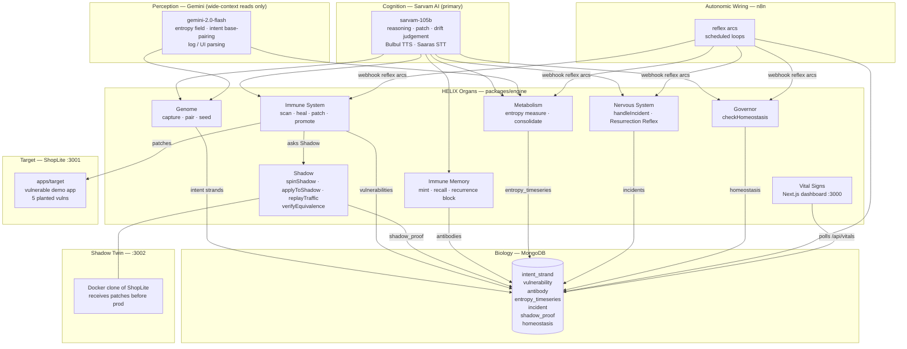

# HELIX

> AI-built software grows at machine speed. HELIX makes it stay alive at machine speed.

HELIX is an autonomous living layer for AI-built software — modelled as an organism with organs that continuously fight divergence. The unifying thesis: **intent drift, code drift, vulnerabilities, production failures, and entropy are one phenomenon** — divergence over time.

---

## Architecture



---

## Organs

| # | Organ | Responsibility | Key functions |
|---|-------|---------------|---------------|
| §3 | **Genome** | Captures and pairs source code intent strands | `captureIntent`, `pairIntent`, `seedShopLite` |
| §4 | **Immune System** | Scans for vulnerabilities, synthesises patches, promotes via Shadow | `scanTarget`, `healVulnerability`, `applyPatch`, `promote` |
| §5 | **Immune Memory** | Mints antibodies from healed vulns, blocks recurrence | `mintAntibody`, `matchAntibody`, `blockRecurrence` |
| §6 | **Metabolism** | Measures code entropy, consolidates duplications | `measureEntropy`, `consolidate` |
| §7 | **Nervous System** | Handles production incidents, Resurrection Reflex | `handleIncident` |
| §8 | **Shadow** | Runs patches against a twin before touching prod | `spinShadow`, `applyToShadow`, `replayTraffic`, `verifyEquivalence` |
| §9 | **Governor** | Homeostasis: gates activity when system is overloaded | `checkHomeostasis` |
| §10 | **Vital Signs** | Live control-plane dashboard | Next.js `/api/vitals` + React dashboard |

---

## Sponsor Stack

| Tool | Role | Used for |
|------|------|---------|
| **Sarvam AI** (primary) | Cognition | All reasoning, patch synthesis, drift judgement, causal reconstruction, behaviour-equivalence judgement, test/assertion generation, Bulbul TTS, Saaras STT |
| **Gemini** (low-surface) | Perception | Wide-context reads only — entropy field computation, intent–code base-pairing across many files, log/UI parsing for Resurrection Reflex |
| **MongoDB Atlas** | Biology / memory | Intent genome, vector antibody library (1536-dim cosine), entropy time-series, incident & proof records |
| **n8n** | Autonomic wiring | Reflex arcs (scan → heal, incident → resurrect), scheduled metabolic loops |

### Fallback chain

- **Sovereign fallback** — set `HELIX_SOVEREIGN=1` + `HELIX_SOVEREIGN_BASE=<OpenAI-compat URL>` to route all reasoning to a local open-weight model. Activates automatically on Sarvam 402/429 (credit exhaustion) when `HELIX_SOVEREIGN_BASE` is configured.
- **Voice fallback** — `ttsSafe()` returns `null` on TTS failure; callers print text instead of playing audio.
- **Vector search fallback** — `matchAntibody()` tries Atlas `$vectorSearch` first; falls back to in-memory cosine similarity when the Atlas index is unavailable.

---

## Repo Structure

```
helix/
├── apps/
│   ├── web/            # Next.js 15 control plane + Vital Signs dashboard (:3000)
│   └── target/         # ShopLite — vulnerable demo app (:3001)
├── packages/
│   ├── shared/         # Types, contracts, error classes — import only, never redefine
│   ├── db/             # Mongoose models, Zod validators, repos, vector index
│   ├── ai/             # Sarvam + Gemini clients (chat, embed, TTS, STT)
│   └── engine/         # All organ logic (genome, immune, memory, metabolism,
│                       #   nervous, shadow, governor)
├── shadow/             # Shadow twin runtime (Docker, :3002)
├── orchestration/n8n/  # docker-compose + exported workflow JSONs
├── scripts/            # setup.mjs, demo.mjs, n8n-sync.mjs
├── Makefile
└── CLAUDE.md           # Operating contract (read every session)
```

### MongoDB Collections

| Collection | Purpose |
|-----------|---------|
| `intent_strand` | Genome — source module intent + pairing score |
| `vulnerability` | Immune — detected vulns with class, endpoint, severity |
| `antibody` | Memory — healed-vuln fingerprints + 1536-dim embeddings |
| `entropy_timeseries` | Metabolism — per-file entropy over time |
| `incident` | Nervous — production failure records |
| `shadow_proof` | Shadow — equivalence verdicts before promotion |
| `homeostasis` | Governor — periodic balance snapshots |

---

## Prerequisites

| Requirement | Version |
|------------|---------|
| Node.js | ≥ 20 |
| pnpm | ≥ 10 |
| Docker Desktop | any recent — for Shadow twin + n8n |
| patch(1) | Xcode CLI Tools (`xcode-select --install`) |

---

## Setup

### 1. Clone and configure

```bash
git clone <repo-url> helix && cd helix
cp .env.example .env
```

Edit `.env` — required keys:

| Key | Purpose |
|-----|---------|
| `SARVAM_API_KEY` | Primary AI — all reasoning and voice |
| `GEMINI_API_KEY` | Perception — entropy + genome pairing |
| `MONGODB_URI` | `mongodb+srv://<user>:<pass>@cluster...` |
| `N8N_ENCRYPTION_KEY` | `openssl rand -hex 16` |
| `NEXT_PUBLIC_SUPABASE_URL` | ShopLite DB |
| `NEXT_PUBLIC_SUPABASE_PUBLISHABLE_KEY` | ShopLite DB |
| `SUPABASE_SERVICE_KEY` | ShopLite DB (server-side only) |

### 2. One-command setup

```bash
make setup
# or: node scripts/setup.mjs
```

This checks prerequisites, initialises `.env`, installs dependencies, typechecks, and seeds the ShopLite intent genome into MongoDB.

Flags:
- `--skip-install` — skip `pnpm install`
- `--skip-check` — skip typecheck
- `--seed-only` — only seed ShopLite intents (re-runnable)

### 3. Start the stack (3 terminals)

```bash
# Terminal 1 — ShopLite target app on :3001
pnpm --filter target dev

# Terminal 2 — HELIX control plane + Vital Signs on :3000
pnpm --filter web dev

# Terminal 3 — n8n orchestration on :5678
docker compose up -d
node --env-file=.env scripts/n8n-sync.mjs sync
```

### 4. Shadow twin (optional — required for full immune demo)

```bash
docker compose -f shadow/docker-compose.yml up -d --build
```

---

## Environment Variables

```bash
# ── AI (Cognition + Perception) ───────────────────────────────────────────────
SARVAM_API_KEY=              # Primary LLM (required for all AI ops)
GEMINI_API_KEY=              # Wide-context perception (entropy + pairing)
HELIX_SOVEREIGN=0            # Set 1 to route reasoning to local open-weight model
HELIX_SOVEREIGN_BASE=        # OpenAI-compat base URL (required when SOVEREIGN=1)
EMBEDDING_PROVIDER=gemini    # gemini | local

# ── Biology / Memory ──────────────────────────────────────────────────────────
MONGODB_URI=                 # mongodb+srv://...
MONGODB_DB=helix

# ── Target + Shadow ───────────────────────────────────────────────────────────
TARGET_APP_URL=http://localhost:3001
SHADOW_APP_URL=http://localhost:3002
TARGET_ALLOWLIST=http://localhost:3001,http://localhost:3002

# ── ShopLite (Supabase) ───────────────────────────────────────────────────────
NEXT_PUBLIC_SUPABASE_URL=
NEXT_PUBLIC_SUPABASE_PUBLISHABLE_KEY=
SUPABASE_SERVICE_KEY=

# ── Orchestration ─────────────────────────────────────────────────────────────
N8N_WEBHOOK_BASE=http://localhost:5678/webhook
HELIX_API_BASE=http://localhost:3000
N8N_ENCRYPTION_KEY=          # openssl rand -hex 16
N8N_API_URL=                 # n8n cloud instance URL
N8N_API_KEY=                 # n8n cloud Public API key
```

---

## Run the Demo

With the stack running:

```bash
make demo
# or: node scripts/demo.mjs
```

**Flags:**
- `--auto` — no pauses, runs all 7 steps automatically
- `--step=N` — start from step N
- `--base=URL` — HELIX API base (default: `http://localhost:3000`)

**Demo steps:**

| Step | What happens |
|------|-------------|
| 1. Target | Verifies ShopLite (:3001) is reachable |
| 2. Scan | Immune System scans ShopLite — finds SQLi, XSS, missingRLS, secretLeak (4 planted vulns) |
| 3. Heal | Synthesises and applies a patch via Shadow; prints before/after diff |
| 4. Entropy | Metabolism measures code entropy and identifies hottest zones |
| 5. Governor | Checks homeostasis — balance, generation/repair rates, action (ok/reprioritise/gate) |
| 6. Nervous | Simulates an incident — causal reconstruction + Resurrection Reflex |
| 7. Vitals | Prints live snapshot from the Vital Signs dashboard |

**Vital Signs dashboard:** [http://localhost:3000](http://localhost:3000)

---

## Developer Commands

```bash
make typecheck     # pnpm -w typecheck — all packages
make lint          # pnpm -w lint — all packages
make test          # vitest — packages/engine
make clean         # remove build artefacts

# Per-package engine CLIs
pnpm --filter engine intent:capture   # capture intent strand
pnpm --filter engine intent:pair      # pair strands (Gemini)
pnpm --filter engine seed:shoplite    # seed ShopLite genome into MongoDB
pnpm --filter engine entropy:measure  # measure code entropy
pnpm --filter engine governor:check   # print homeostasis snapshot
pnpm --filter engine scan             # run immune scanner
```

---

## Shadow Invariant

**No write ever reaches the real target without a `shadow_proof` with `verdict: 'promote'`.**

Every patch flows: `applyToShadow` → `replayTraffic` → `verifyEquivalence` → `assertPromotable(proof)` → only then `promote` writes to the real app. `assertPromotable` throws `VerificationError` on any non-promote verdict. This invariant is enforced in code and is inviolable.

---

## Planted Vulnerabilities (ShopLite)

ShopLite has **exactly four** planted vulnerabilities (T1.1 spec). The `authBypass` class exists in the scanner and VulnClass enum but is not a separately planted vuln — the scanner deduplicates it when `missingRLS` covers the same `/admin/orders` endpoint.

| Class | Endpoint | Description |
|-------|---------|-------------|
| `SQLi` | `/api/products/search` | Raw string concatenation into SQL (`unsafe_search` RPC) |
| `XSS` | `/search` | Unsanitised `?q=` reflected via `dangerouslySetInnerHTML` |
| `missingRLS` | `/admin/orders` | Supabase `orders` table has no RLS — any user reads all orders |
| `secretLeak` | `/` (client bundle) | Supabase service-role key in a `"use client"` module |

Ground truth is in `apps/target/vulns.manifest.json`.
